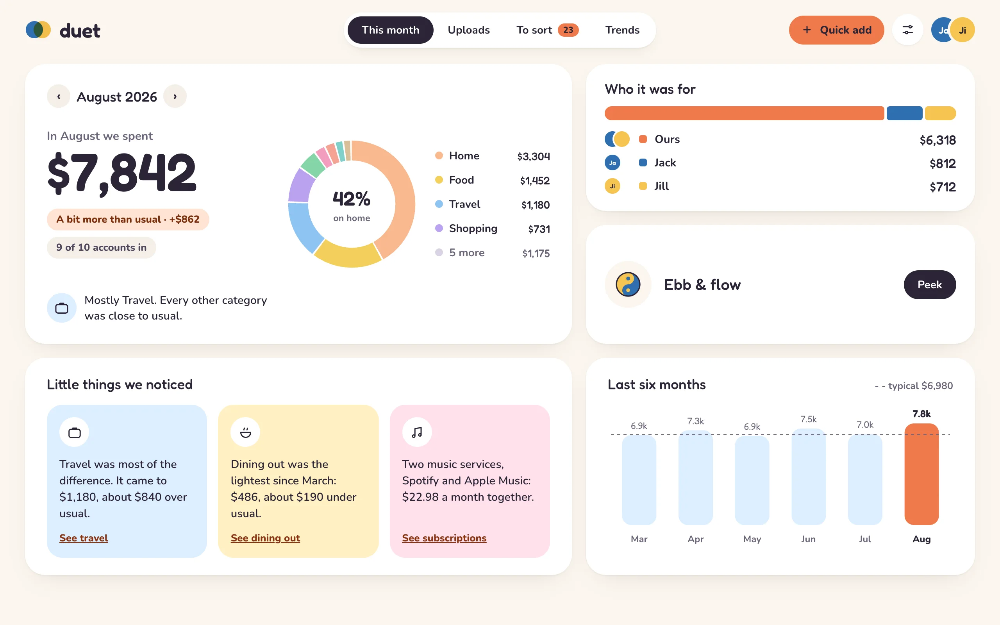
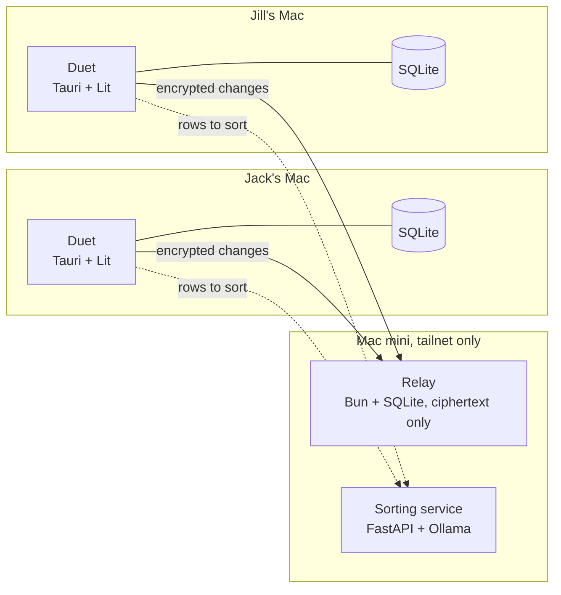

<p align="center"></p>

<h1 align="center">Duet</h1>

<p align="center"><b>Couple finances, in harmony.</b><br />A free, private, local-first money app for two, on your own Macs.</p>

<p align="center">
  <a href="https://firstprateek.github.io/duet/">Download</a> ·
  <a href="https://firstprateek.github.io/duet/demo/">Try the demo</a> ·
  <a href="docs/self-hosting.md">Mac mini guide</a> ·
  <a href="docs/spec.md">Spec</a> ·
  <a href="docs/design/README.md">Designs</a>
</p>

<picture>
  <source media="(prefers-color-scheme: dark)" srcset="site/assets/screens/month-dark.webp" />
  
</picture>

Each of us uploads our own bank and card statements, sorts them into **Ours** or **Mine**, and
adds them to a shared month. Duet shows where our money went, what a typical month looks like,
and **Ebb & flow**: who has carried a little more toward Ours, measured against **Our rhythm**
(the split we set from our incomes). No due dates, no debts, just a **Clean slate** whenever we
feel like evening out.

Everything runs on our own computers. A Mac mini on our tailnet relays end-to-end-encrypted
changes between the two Macs and runs the local models that help with sorting. It only ever
stores ciphertext.

## Install

On macOS 13 or later (Apple silicon or Intel):

```bash
curl -fsSL https://firstprateek.github.io/duet/install.sh | sh
```

Or download the app from the [website](https://firstprateek.github.io/duet/). Duet isn't
notarized by Apple, so a browser download needs one extra step, which the site walks through.
Updates arrive in the app, each checked against Duet's own signature. To pair two Macs, set up
a Mac mini with [the guide](docs/self-hosting.md), then send a join link from Settings.

The [demo](https://firstprateek.github.io/duet/demo/) is the same app in the browser, opening on
Jack and Jill's year. They're made up, and so are their numbers.

## What it does

| | |
| --- | --- |
| **Ours and Mine** | Every purchase is one or the other. Mine stays personal: the other Mac only ever gets its totals by category. |
| **Ebb & flow** | One running number, measured against Our rhythm, with Clean slates to bring it back to zero. Rounding happens once a month, in integer cents, so nothing drifts. |
| **Statements, not bank logins** | CSV, XLSX and OFX/QFX from ten US banks and cards, with duplicates, card payments, transfers and refunds caught on the way in. Unfamiliar layouts get a one-time column setup. |
| **Sorting that learns** | Our rules, our own history, a starter pack of merchants and the bank's categories sort most rows. The Mac mini's embeddings and a small LLM help with the rest, and `duet eval` replays our history to check they earn their place. |
| **End-to-end encrypted sync** | XChaCha20-Poly1305 records in an append-only log, per-field last-writer-wins merging on hybrid logical clocks, 24-word recovery phrases, and join links whose code never reaches a server. |
| **Ours to inspect** | `duet export` turns everything into JSON, CSV and SQLite with a recovery phrase, straight from the relay or any backup. |

## How it fits together



| Path | What | Stack |
| --- | --- | --- |
| `packages/core` | All business logic: money, Ebb & flow, imports, rules, sync client, crypto | TypeScript, `@noble/ciphers`, `@noble/hashes`, `@scure/bip39` |
| `packages/importers` | Statement readers and bank profiles (MIT) | CSV, SheetJS, our own OFX reader |
| `packages/ui` | Components and design tokens | Lit 3, hand-drawn SVG charts |
| `apps/desktop` | The app | Tauri 2, Lit, signals; about 150 lines of Rust for SQLite and the keychain |
| `services/sync` | The relay on the Mac mini | Bun, `bun:sqlite`, one compiled binary under launchd |
| `services/sorter` | Embeddings and a small LLM, keeping nothing | Python, FastAPI, Ollama |
| `tools/cli` | `duet export`, `inspect`, `eval`, `phrase` | Node |
| `site` | The website: download, join and demo pages | Static HTML on GitHub Pages |

## Status

| Milestone | What ships | State |
| --- | --- | --- |
| M0 Foundations | Monorepo, Tauri + Lit shell, tokens, SQLite, pipelines, installer, updater | Done |
| M1 Uploads and sorting | CSV / XLSX / OFX, ten bank profiles, duplicates, transfers, refunds, To sort | Done; Bread Cashback and DCU wait for real sample files |
| M2 Month view and Ebb & flow | Month, Trends, Transactions, Our rhythm, Clean slate, insights | Done |
| M3 Sync and encryption | Keys, recovery phrases, pairing, relay, merging, export CLI | Done |
| M4 Smart sorting | Embeddings, local LLM, Laya, evaluation | Embeddings and the LLM done; Laya waits to be trained on our own history |
| M5 v1.0 | Accessibility, first run, README and self-hosting guide | Done on macOS; Windows and Linux not tried yet |

## Development

Needs Node 22.13+ and pnpm; the desktop app also needs Rust.

```bash
pnpm install
pnpm test
pnpm lint      # Biome's lint and format checks
pnpm typecheck # tsc in every package
pnpm dev:web   # the app in a browser; open http://localhost:5174/?sample for sample data
pnpm dev       # the desktop app, with its own database and keychain items
pnpm site      # the website and the demo, into _site/
```

The browser preview keeps everything in memory, so a reload starts over. To try sync there, run
`pnpm relay:dev` and use `http://127.0.0.1:8787` as the Mac mini's address. CI runs lint, types
and tests on every push; merging Release Please's pull request builds a signed release, and the
website redeploys from `main`.

## Built with Claude Code

Duet was built with [Claude Code](https://claude.com/claude-code), Anthropic's coding agent,
from the [spec](docs/spec.md) and [design mocks](docs/design/README.md) onward: the core logic,
the Rust shell, the relay, the sorting service, the tests, the release pipeline and this
website. Its working notes are in [CLAUDE.md](CLAUDE.md), and the commits it wrote say
`Co-Authored-By: Claude`.

## License

The app and server are AGPL-3.0. The statement importers in `packages/importers` are MIT, so
anyone can reuse the bank profiles.
