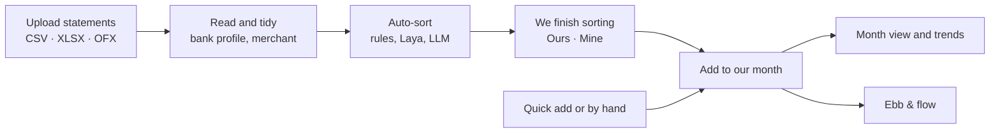
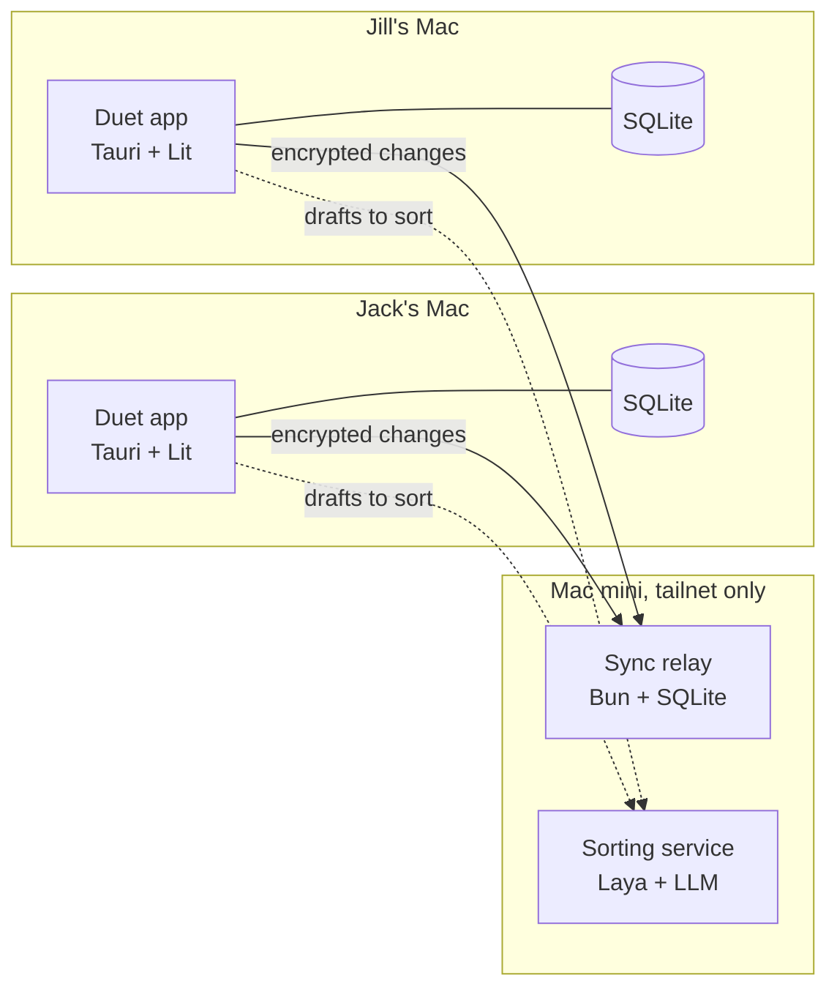
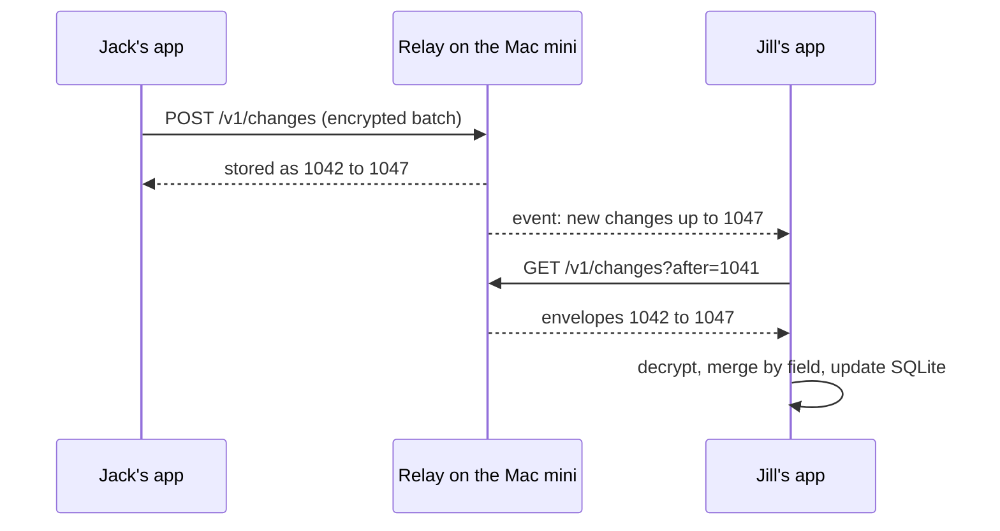
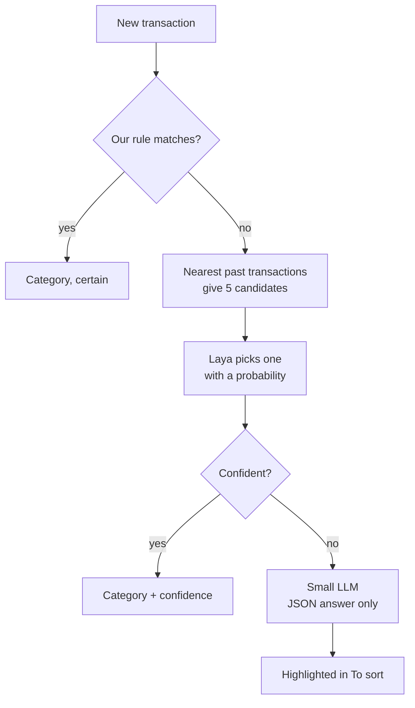

# Duet — v1 spec

> Written on Sep 23, 2026 as a Claude Doc, reviewed against the design mocks, and copied here on
> Sep 26, 2026 once the repository went public. The sample couple is Jack and Jill. Where the code
> departs from this spec on purpose, [CLAUDE.md](../CLAUDE.md) says so; the README has the
> milestones' current state.

Duet is an open-source, local-first desktop app where Jack and Jill upload their monthly statements, finish sorting the transactions, and add them to a shared month. A Mac mini on their tailnet relays end-to-end-encrypted changes and runs the local categorizer.

## Scope

v1 answers one question for Jack and Jill: where does our money go each month, and what is a realistic month for us? It tracks all spending (food, clothes, travel, rent, utilities and so on) and leaves income, budgets and investments for later.

| Area | In v1 | Later versions |
| --- | --- | --- |
| People | Two per household, names set at first launch | Joint accounts; one server hosting many households |
| Money tracked | Expenses of every kind | Income; budgets ("Our plan"); brokerage |
| Sources | CSV, XLSX, OFX/QFX from ten US institutions; manual entry and quick add | PDF statements; Indian banks and INR |
| Sorting | Rules, embeddings and a small LLM from day one; Laya once trained on our own history; all local on the Mac mini | Automatic monthly retraining |
| Sharing | Ours / Mine, Our rhythm, Ebb & flow | Paying for something that is just for the other person (open question) |
| Sync | Self-hosted relay on the Mac mini, end-to-end encrypted | Statement files backed up to the server |
| Platforms | macOS first; Windows and Linux from the same code | iOS and Android through Tauri mobile |
| Releases | GitHub Actions builds and in-app updates | Apple notarization if the project grows |
| License | AGPL-3.0 for app and server; MIT for the statement importers | — |

## Words we use

These are the final words, chosen while reviewing the mocks. The code keeps every term in one dictionary, so changing one later is a one-line edit.

| Concept | Word | Never say |
| --- | --- | --- |
| Shared expense | Ours | shared cost, split |
| Personal expense | Mine when choosing; the person's name in totals (Jack, Jill) | personal liability |
| Checking each transaction's category and Ours or Mine | To sort (the tab), sorting | review, audit, reconcile |
| Adding sorted transactions to the month | Add to August | publish, submit, post, save, tuck into |
| Kept out of the month (card payments, duplicates) | Set aside | ignore, exclude, delete |
| Income ratio | Our rhythm (58 / 42) | split ratio, allocation |
| Running difference | Ebb & flow, with a yin-yang icon | owe, debt, balance due, IOU, back & forth |
| Opening and closing the Ebb & flow card | Peek · Tuck away | show balance, hide |
| Evening out | Clean slate | settle up, pay back, reimburse |
| Nearly even (within $25) | You're in step | even, square |
| Where our statement files go | Uploads, with an Upload button | inbox (nothing arrives by itself), documents, brought in |

There is no "partly shared" choice: every purchase is Ours or Mine. The rare mixed purchase becomes two entries by hand (decided Sep 24).

Tone rules:

- Plural and personal: "we", "our", and names. Never "user", "payer" or "account holder".
- A difference is appreciation, not debt: "Jill has carried a little more lately", never "Jack owes Jill".
- Color never judges a person. Red is for errors only, never for whoever carried less.
- No nudges, due dates, reminders or streaks about evening out.
- Insights suggest, never scold: "Dining was the lightest since March", not "You overspent on dining".
- Personal stays personal: the partner's "Mine" merchants never appear anywhere, insights included.
- Clear beats cute: if a word needs explaining, pick another.
- Don't spell out who sees what; it becomes obvious with use.

## Look and feel

Direction C, Soft & friendly, is final. The screens are in [docs/design](design/README.md), next to the earlier A and B explorations.

| Token | Value | Used for |
| --- | --- | --- |
| Background | #FBF6EF, warm cream | The app behind every card |
| Card | #FFFFFF, 24 to 30px corners, soft shadow | Every panel |
| Ink | #2B2536 | Text and primary buttons |
| Muted | #6B6478 | Secondary text (5.6:1 on white) |
| Ours | #F07A4A, orange | Ours bars, Quick add button |
| First partner | #2F6FB0, blue (Jack in the mocks) | Avatar, their side of Ebb & flow |
| Second partner | #F5C451, yellow (Jill in the mocks) | Avatar, their side of Ebb & flow |
| Category pastels | Peach, butter, sky, lilac, mint, pink, coral, aqua, sand | Category bubbles and charts |
| Type | Fredoka for headings and numbers, Nunito for text | Everywhere |
| Shape | Pill buttons and tabs; rounded cards | Everywhere |

- The Ebb & flow mark is a yin-yang in the two partners' colors.
- Icons are rounded strokes inside pastel bubbles, never emoji.
- Appearance is Match my Mac (the default), Light or Dark, chosen per Mac. The dark palette is still to be drawn.

## The monthly flow

Each of us uploads our own statements, sorts them, and adds them to the month; the month view then shows where the money went. Manual entries skip sorting.



Removed rows, card payments and duplicates never leave the Mac they were brought in on.

| Screen | What it does |
| --- | --- |
| Month | Total, Ours vs each person's Mine, categories against a typical month, three insights, Ebb & flow behind a reveal |
| Ebb & flow history | Opened from the card's History link: each month's figure, the running total after it, and where a Clean slate was recorded |
| Trends | 12 months by category and person, plus "a typical month for us" (6-month median per category) |
| To sort | Keyboard-first grid of one statement: suggested category with confidence, Ours or Mine, duplicate and transfer flags, "always do this" rules |
| Add to our month | Confirmation: what Jill will see, what stays on this Mac, what was set aside |
| Uploads | Every file we've uploaded, by month and account: statements now, receipts and pay stubs later. Shows status, re-read, remove, and which accounts are still missing for the month |
| New card found | Sheet on the first upload from an unknown card or account: name, whose it is, kind, and whether its purchases usually start as Ours or Mine |
| Transactions | Everything added, including Clean slate entries; filters, added-on dates, change history |
| Quick add | ⌘K bar: "42 trader joes groceries yesterday" becomes one entry |
| Settings | Us (names, Our rhythm, Ebb & flow visibility), accounts, categories, sync and security, smart sorting, appearance (Match my Mac, Light or Dark, chosen per Mac), updates |

Keys while sorting: `O` Ours, `M` Mine, `C` category, `Delete` set aside, `J`/`K` move, `Shift` to select a range, `⌘Enter` add to the month. Each account can default to Ours or Mine, so a grocery card starts as Ours.

## Ebb & flow and Our rhythm

Ebb & flow is one running number: how much more one of us has paid toward Ours than our share under Our rhythm. It has no due date. A Clean slate entry brings it to zero, and later expenses can move it again.

**The math**, from Jack's side (positive means Jack has carried more). For month *m*: *S* is everything Ours (minus refunds), *P* is the part of *S* that Jack paid, *r* is Jack's share for that month, and *E* are Clean slate entries applied to that month.

```latex
G_m = P_m - \operatorname{round}(r_m S_m) \; - \; E_m^{\text{Jill}\to\text{Jack}} \; + \; E_m^{\text{Jack}\to\text{Jill}}
```

The overall number is the sum of every month's figure plus any entries applied to Overall. Amounts are integer cents, the ratio is stored in basis points (5800 = 58%), and rounding happens once per month so nothing drifts.

August in the mocks, at 58 / 42 with $6,318 of Ours:

|  | Jack | Jill |
| --- | --- | --- |
| Paid toward Ours | $3,402.00 | $2,916.00 |
| Share at 58 / 42 | $3,664.44 | $2,653.56 |
| Difference | −$262.44 | +$262.44 |

So the month reads "Jill carried $262 more in August".

**Rules**

- Mine never counts. A purchase that is partly personal becomes two entries, one Ours and one Mine.
- A refund takes the category and share of the purchase it reverses, so it flows through the same sums.
- Card payments and transfers between our own accounts are left out entirely.
- An old expense added later changes that month and the overall number. The month then says "2 added after your clean slate on Sep 5", and every transaction shows the date it was added.

**Our rhythm** is a household setting that takes effect from a chosen month onward (for example 60 / 40 from Jan 2025, then 58 / 42 from Jan 2026).

- Each month uses the ratio in effect for it, so editing an old expense uses that month's ratio.
- Either of us can change it without approval. The other sees a gentle note and the history.
- A helper can work out the ratio from our salaries without saving them. Only the percentage syncs.
- Before saving a change to an existing period, Duet shows how Ebb & flow would move.

**Clean slate** entries record who gave whom how much, the date, and what it applies to: one month (the default is the month on screen) or Overall.

- Create one from the Ebb & flow panel ("Clean slate", prefilled with that month's figure), or mark a Zelle or transfer between us as a Clean slate while sorting.
- They show in Transactions and never on the Month dashboard.

**Where it shows**

- The Month view keeps Ebb & flow behind a small yin-yang button. One click reveals that month's figure and a link to the overall number.
- A per-device setting, "Always show Ebb & flow", shows it all the time. Each of us chooses our own.
- A History view, opened from the card, charts each month and the running total, with Clean slate entries marked.

When the running number is within $25 of zero, the card shows "You're in step" instead of a figure.

## Who sees what

Only what we add to the month is shared, and each person's Mine is shared only as totals by category. Everything else stays on the Mac it came from.

| Data | Lives on | Readable by |
| --- | --- | --- |
| Statement files | The Mac that brought them in | That person |
| Drafts, removed rows, card payments, duplicates | That Mac | That person. Drafts pass through the Mac mini's memory for sorting and are never stored there |
| Ours transactions | Both Macs; the server as ciphertext | Both of us |
| Mine transactions, full detail | The owner's Mac | The owner only |
| Mine totals by month and category | Both Macs; the server as ciphertext | Both of us |
| Categories, accounts, Our rhythm, Clean slate, household rules | Both Macs; the server as ciphertext | Both of us |
| Rules learned from Mine transactions | The owner's Mac | The owner only, because they would reveal merchants |
| Keys | Each Mac's keychain; the server keeps only wrapped copies | Whoever holds a recovery phrase |

- Switching an added transaction from Ours to Mine removes it from the other Mac and folds it into the Mine totals.
- Account names and last four digits are shared, because Ours transactions point to them.
- Losing a Mac loses its Mine details and statement files unless Time Machine has them. Household data comes back from the server. See the personal vault question under Open questions.

## Architecture

Two desktop apps and one Mac mini. Each Mac keeps a full SQLite copy and works offline. The Mac mini relays encrypted changes and runs the sorting models, reachable only on our tailnet.



All business logic lives in `packages/core`: plain TypeScript with no Tauri imports, so the same code runs in the app, the CLI, the tests and, later, on mobile. Rust stays at about 30 lines: one keychain command.

| Layer | Choice | Why |
| --- | --- | --- |
| Shell | Tauri 2 with official plugins (sql, fs, dialog, updater) | Small builds for macOS, Windows and Linux |
| UI | Lit 3, our own components on design tokens, `@lit/context` and signals for state | A look of our own; web standards |
| Grids | `@tanstack/lit-table` + `@tanstack/lit-virtual` | To sort and Transactions stay fast at thousands of rows |
| Charts | ECharts themed from our tokens; small charts as hand-drawn SVG | One library for trends; no generic look |
| Local database | SQLite through `tauri-plugin-sql`, Drizzle ORM (sqlite-proxy driver) and migrations | A real file on disk, typed queries |
| Statement reading | papaparse (CSV), SheetJS CE (XLSX, XLS), our own OFX reader, all in a Web Worker | The UI stays smooth on big files |
| Encryption | `@noble/ciphers` (XChaCha20-Poly1305), `@noble/hashes` (HKDF), `@scure/bip39` (recovery phrase) | Audited, pure TypeScript, works in app, server and CLI |
| Sync relay | Bun + `bun:sqlite`, one compiled binary under launchd | Tiny, no runtime to install |
| Sorting service | Python: Laya on MLX, Ollama for the LLM and embeddings, FastAPI | The only piece not in TypeScript |
| Tooling | pnpm workspaces, Vitest, Playwright component tests, Biome | One install, fast checks |

```text
duet/
  apps/desktop/        Tauri shell and Lit screens
  packages/core/       money, Ebb & flow, duplicates, rules, sync client, crypto
  packages/importers/  CSV, XLSX, OFX readers, bank profiles, fixtures (MIT)
  packages/ui/         Lit components and design tokens
  services/sync/       Bun relay
  services/sorter/     Laya and LLM service (Python)
  tools/cli/           export, inspect, key tools
  .github/workflows/   ci.yml, release.yml
```

## Sync and encryption

Every change is a small encrypted record in an append-only log. The relay numbers the records and hands them out, but it can never read them.

**A change record** before encryption:

```json
{
  "id": "01J8Z6Q4R7…",
  "hlc": "2026-09-23T18:04:11.201Z-0003-jack-mbp",
  "entity": "transaction",
  "entityId": "tx_4f1c…",
  "fields": { "categoryId": "groceries" },
  "schema": 1
}
```

The relay stores only an envelope: its own sequence number, the stream, the device id, a nonce and the ciphertext.

**Merging.** Each field keeps the value with the newest hybrid logical clock (HLC); the device id breaks ties. Deletes are a `deletedAt` field, so they merge the same way. Conflicts are rare because each of us brings in our own statements, and the change history shows both edits when one happens.



Changes wait in a local outbox while offline and go out on reconnect, on app focus, and every 60 seconds while the app is open.

| Endpoint | Purpose |
| --- | --- |
| `POST /v1/changes` | Push a batch; record ids make retries safe |
| `GET /v1/changes?after=N` | Pull everything after sequence N |
| `GET /v1/events` | Server-sent events: "there is something new" |
| `POST /v1/devices` | Pair a device with a one-time invite |
| `GET /v1/keys` | The household key, wrapped for each person |
| `GET /v1/health` | Status and protocol version for the settings screen |

Every request carries a device token and a protocol version. The relay accepts the current and previous protocol. An app that meets a newer data schema asks to update instead of guessing.

**Keys**

- One random 256-bit household key encrypts every shared record with XChaCha20-Poly1305. The record id and device id are bound in as associated data.
- Each of us has a 24-word recovery phrase. It derives a personal wrapping key through HKDF.
- The relay keeps the household key only wrapped by each person's key. Jack's phrase alone opens all household data, so you can always inspect it.
- Each Mac keeps the household key and its device token in the macOS keychain.

**Pairing and recovery**

1. Jack sets up first: both names, a new household, the Mac mini address, and a recovery phrase shown once (Duet checks three of its words).
2. Jack's app shows a join code that expires in 10 minutes and works once (later: a day, sent as a link). It carries the server address, an invite token and the household key.
3. Jill scans or pastes it. Jill's app creates Jill's own phrase, uploads a wrapped copy of the household key and receives a device token.
4. On a new or wiped Mac, "Restore" asks for the phrase, unwraps the household key from the relay and rebuilds the database from the log.
5. A lost Mac is removed in Settings, which revokes its token. Replacing the household key is a later-version feature.

The log grows by roughly 20,000 records a year, a few megabytes. Snapshots and compaction can wait.

## Uploading statements

Duet reads CSV, XLSX and OFX/QFX. A bank profile recognizes each file by its columns; an unfamiliar file gets a one-time column-matching step that is saved as a new profile.

The quirks below are from memory of recent exports. M1 confirms each one against our own anonymized files, which become test fixtures.

| Institution | Formats | Quirks the profile handles |
| --- | --- | --- |
| American Express | CSV, XLSX, QFX | Charges positive, credits negative |
| Capital One | CSV, QFX | Separate Debit and Credit columns; bank category |
| Discover | CSV, QFX | Charges positive; bank category |
| Chase | CSV, QFX | Charges negative; a Type column marks payments and returns |
| Apple Card | CSV, OFX, one month per export from Wallet on iPhone | Charges positive; clean Merchant and Purchased By columns |
| Bread Cashback | To confirm | Unknown until we see a file |
| Citi | CSV, QFX | Separate Debit and Credit columns; Status column |
| DCU | CSV, OFX/QFX | To confirm |
| Wells Fargo | CSV, QFX | CSV has no header row; debits negative |
| Bank of America | CSV, QFX | Checking CSV opens with a summary block before the rows; debits negative |

A profile is plain data in `packages/importers`, so adding a bank is a small pull request:

```ts
export const chaseCard: BankProfile = {
  id: "chase-card-csv",
  institution: "Chase",
  detect: { headers: ["Transaction Date", "Post Date", "Description", "Category", "Type", "Amount", "Memo"] },
  date: { column: "Transaction Date", format: "MM/dd/yyyy" },
  description: "Description",
  amount: { column: "Amount", spendingIs: "negative" },
  bankCategory: "Category",
  kind: { column: "Type", payment: ["Payment"], refund: ["Return"] },
};
```

**What happens to a file**

1. **Same file twice.** A SHA-256 of the file catches it: "Already brought in on Sep 3."
2. **Recognize.** Header signature, or the institution tags inside OFX. No match: the local LLM proposes a column mapping from the header and five rows, and we confirm it.
3. **Tidy.** Date, amount in cents with spending positive, raw description, clean merchant name, bank category, account (from the card number column when present, otherwise asked once).
4. **Duplicates.** An exact match on account, date, amount and description is set aside automatically. A near match (same amount within 3 days, similar text, overlapping files) is flagged for us.
5. **Transfers.** Card payments (autopay lines, "payment thank you", a Payment type) and the matching bank debit within 5 days are marked as transfers and left out. Money moving between Jack's and Jill's accounts is suggested as a Clean slate.
6. **Refunds.** A credit is matched to the purchase it reverses (same merchant, within 90 days) and takes that purchase's category and Ours or Mine. Unmatched credits are flagged.

**Uploads** lists each file with its account, dates, row counts and status: Sorting (with how many are left), Added, or Needs a one-time setup. It shows which of our accounts are still missing for the month. Re-reading a file with an improved profile changes only the rows not yet decided. Removing a file asks whether to also remove the transactions it added. Later versions add receipts and pay stubs here too. It is Uploads rather than Inbox because nothing arrives by itself; if automatic bank feeds ever come, the name gets another look.

**By hand.** Manual entries and quick add ask for amount, merchant, date, category, Ours or Mine, and optionally an account such as Cash or Venmo. They go straight to the month.

## Smart sorting

Sorting runs in tiers, cheapest first, and learns from every correction. Laya's base model is near chance without training, so it joins after we fine-tune it on our own reviewed transactions; until then the LLM handles hard cases. Laya only ever chooses among about five candidates, because its accuracy drops sharply past about 20 options.



| Tier | Runs on | What it does |
| --- | --- | --- |
| Rules | Each Mac | Merchant patterns we confirmed, a starter pack of common US merchants, and a map from bank categories to ours |
| Embeddings | Vectors from the Mac mini; matching on each Mac | Finds the nearest past transactions in our own history and proposes the top 5 categories |
| Laya | Mac mini, through Laya's own HTTP server (PyTorch or ONNX; a community MLX port exists) | Once trained on our history, chooses among those 5 and returns a probability |
| Small LLM | Mac mini, through Ollama | Low confidence, new merchants, and everything Laya would do before it is trained. Output is forced to `{categoryId, confidence}` |
| Us | To sort | Every correction becomes or updates a rule and joins the history the embeddings search |

Confidence of 0.85 or more shows plainly, 0.6 to 0.85 shows a small dot, and below 0.6 the row is highlighted. M4 tunes these numbers on our own data.

The same history suggests Ours or Mine, together with the account's default. Mine history stays on its owner's Mac, so those suggestions are personal.

**Other jobs for the LLM**: reading quick-add text, cleaning merchant names, matching columns in unfamiliar files, and phrasing the monthly insights. Code computes every number; the model only writes the sentence, so it cannot invent figures.

**The sorting service keeps nothing.** It has three endpoints: `POST /v1/embed`, `POST /v1/choose` (Laya) and `POST /v1/generate` (LLM with a JSON schema). Request logging is off.

**Measure before trusting.** Laya's benchmarks are self-reported. An evaluation script replays our reviewed transactions through each tier and reports accuracy and how many rows each threshold would leave for us. A model ships only if it beats rules plus embeddings alone.

**Training Laya.** Bringing in 6 to 12 months of past statements in the first week gives roughly 2,000 to 3,000 reviewed transactions. M4 fine-tunes Laya on them on the Mac mini, and the evaluation decides whether it takes routine rows from the LLM. It retrains monthly as corrections add up.

**Models.** The LLM is picked in M4 by that evaluation: a 7B to 9B instruct model at 4-bit uses about 5 to 6 GB. Together with Laya (under 1 GB) and an embedding model, it fits easily in 32 GB.

When the Mac mini is out of reach, rules still run and everything else waits: "12 waiting to be sorted".

## Data model

Eight entities are shared through the household log. Everything tied to one person's files or private spending stays in that Mac's database.

| Entity | Main fields | Lives |
| --- | --- | --- |
| Member | id, name, color | Shared |
| SharePlan (Our rhythm) | fromMonth, Jack's and Jill's share in basis points, changedBy, note | Shared |
| Category | id, name, parent, icon, color, archived, order | Shared |
| Account | id, owner, institution, name, last 4, kind (credit, checking, savings, cash, wallet), default Ours or Mine | Shared |
| Transaction | id, account, paidBy, date, amount, merchant, description, category, note, source (statement or by hand), addedAt, addedBy, editedAt, deletedAt | Shared |
| MineTotal | member, month, category, total, count | Shared |
| CleanSlate | from, to, amount, date, appliesTo (a month or Overall), note | Shared |
| HouseholdRule | match (contains, exact or pattern), category, optional Ours or Mine | Shared |
| StatementFile | file name, SHA-256, path, account, profile, first and last date, broughtInAt, status, row counts | This Mac |
| Draft | transaction fields, suggestion (category, confidence, tier, alternatives), flags (duplicate, transfer, refund, Clean slate candidate), decision | This Mac |
| MineTransaction | the Transaction fields, for Mine | Owner's Mac |
| PersonalRule | like HouseholdRule, learned from Mine | Owner's Mac |
| Embedding | text hash, vector | This Mac, rebuildable |
| SyncState | outbox, last sequence seen, clock per field | This Mac |

Conventions: amounts are integer cents with spending positive and refunds negative. Dates are plain calendar dates with no time zone. Months are `YYYY-MM` keys. Ids are UUIDv7, so they sort by creation time.

## Mac mini setup

The Mac mini runs four always-on services under launchd and answers only on our tailnet. What it stores is ciphertext, so its backups can go anywhere.

| Service | How it runs | Reachable at |
| --- | --- | --- |
| Tailscale | The open-source `tailscaled` daemon (Homebrew), so it runs with nobody logged in | — |
| Sync relay | `duet-sync`, one compiled binary, LaunchDaemon with KeepAlive | localhost:8787, published over HTTPS with `tailscale serve` |
| Sorting service | Python with MLX (Laya), LaunchDaemon | localhost:8788, published under `/sort` |
| Ollama | `ollama serve` under launchd; LLM and embedding model | localhost only, never published |

- **Access.** A Tailscale ACL lets only Jack's and Jill's Macs reach the Mac mini on port 443. Device tokens are a second lock.
- **Power.** Energy settings: never sleep, and start again after a power failure.
- **Backups.** A nightly copy of the relay database is kept for 30 days plus 12 monthly copies, via Time Machine or restic to a USB drive and optionally a cloud bucket.
- **Updates.** `duet-server update` fetches the latest compatible server release from GitHub, checks its SHA-256 and signature, swaps the binary and restarts it. Run it by hand or from a weekly launchd timer.
- **Inspecting data.** `duet export --out ./export` asks for a recovery phrase, never stores it, and writes decrypted JSON, CSV and a SQLite file. It works against the live relay or any backup file.
- **Health.** Settings shows relay status, last sync, and which sorting models are loaded.
- **Memory.** Roughly 5 to 6 GB for the LLM, under 1 GB for Laya and the embedding model, and about 50 MB for the relay.

## Releases without an Apple Developer account

Duet is signed with a free certificate we make ourselves, installed with a one-line script that avoids macOS's quarantine flag, and updated from inside the app. The only friction is one extra step for anyone who downloads the DMG in a browser.

**How it works on macOS**

1. **Signing.** Make a self-signed Code Signing certificate once in Keychain Access (Certificate Assistant). CI imports it from a GitHub secret and signs every build with it. A stable signature lets macOS remember keychain permission across updates. If codesign refuses it in CI, the fallback is ad-hoc signing: it works, but asks for keychain access once after each update.
2. **First install.** One command (below) downloads the latest release, checks its SHA-256 and unpacks it into Applications. Files fetched with curl are not marked as quarantined, so Gatekeeper does not block the first launch.
3. **Browser download instead.** Open the DMG, drag Duet to Applications, then System Settings → Privacy & Security → Open Anyway. On macOS 15 and later the old Control-click shortcut is gone. `xattr -dr com.apple.quarantine /Applications/Duet.app` also works.
4. **Updates.** Tauri's updater checks `latest.json` on GitHub Releases, verifies the update with our own updater key (free, from `tauri signer generate`) and installs it in the app. The app downloads the update itself, so macOS does not quarantine it. M0 proves this end to end with a dummy release.

```bash
curl -fsSL https://firstprateek.github.io/duet/install.sh | sh
```

Without Apple's notarization, our safety comes from HTTPS from our own repo, the checksum and the updater signature. Guard the updater private key: whoever holds it can ship updates to both Macs.

On Windows, the first launch shows SmartScreen once (More info → Run anyway). Linux gets an AppImage and a .deb with no extra step.

**Pipelines**

| Workflow | Runs on | What it does |
| --- | --- | --- |
| `ci.yml` | Every pull request and push to main | Lint (Biome), type-check, Vitest (core logic, importer fixtures, Ebb & flow property tests), Playwright component tests, desktop build check |
| Release PR | Merges to main | Release Please drafts the version bump and changelog; merging it creates the tag |
| `release.yml` | Tags `v*` | `tauri-action` builds a universal macOS app, Windows and Linux; signs; publishes a GitHub Release with `latest.json`, checksums, the server binary and the sorting service bundle |

GitHub-hosted macOS runners are free for public repositories. The Mac mini should not be a self-hosted runner for a public repo, because pull requests from forks could run code on it.

## Milestones

Six milestones, each ending in something we can use. The app is useful on one Mac from M2; sync arrives in M3, and smart sorting in M4.

| Milestone | What ships | Done when | Status |
| --- | --- | --- | --- |
| M0 Foundations | Monorepo, Tauri + Lit shell, design tokens for the chosen direction, SQLite and migrations, both pipelines, install script, updater | Both Macs install with the script and take a dummy update with no prompts | In progress |
| M1 Uploads and sorting | CSV, XLSX and OFX readers; ten bank profiles tested on our anonymized files; duplicates, transfers, refunds; Uploads; To sort with keys; manual entry; rules and bank-category mapping | One real month from all ten accounts goes from files to added in under 30 minutes | In progress |
| M2 Month view and Ebb & flow | Month view, Trends, Transactions with history, Our rhythm, Ebb & flow (monthly, overall, Clean slate), insights computed in code | Ebb & flow matches a hand-built spreadsheet for three real months | In progress |
| M3 Sync and encryption | Keys and recovery phrases, pairing, relay on the Mac mini, change log and merging, Mine totals, device removal, export CLI, backups | Jill's Mac shows Jack's added month within a minute, and a wiped Mac restores from its phrase | In progress |
| M4 Smart sorting | Sorting service (embeddings, LLM), Laya fine-tuned on our history, confidence display, quick-add text, merchant clean-up, column matching, insight wording, evaluation script | At least 90% of a new month's rows need no correction (target to confirm with the evaluation) | In progress |
| M5 v1.0 | Accessibility pass, empty states, first-run setup, Windows and Linux smoke tests, README and self-hosting guide, the v1.0 tag | A third Mac gets running by following only the README | In progress |

## Later versions

Nothing below blocks v1. The data model already leaves room for each item.

| Theme | Items |
| --- | --- |
| Money | Income and savings rate; budgets ("Our plan"); recurring charges and a subscription finder; brokerage accounts |
| Sources | PDF statements; Indian banks and INR with exchange rates on the transaction date; receipts attached to transactions; automatic bank feeds (for example SimpleFIN Bridge), weighing the privacy cost |
| Sharing | Joint accounts; paying for something that is just for the other person |
| Privacy and sync | Statement files backed up to the server, readable only by whoever brought them in; household key rotation; log snapshots and compaction |
| Sorting | Automatic monthly retraining of Laya |
| Platforms | iOS and Android through Tauri mobile, starting with quick add |
| Product | One server hosting many households with invites; Apple notarization if the project grows |

## Open questions

Nine decisions are left. The first two come from the mocks; the rest have a proposed answer we can accept or change.

- [x] **Design direction and wording.** Decided on Sep 24: C, Soft & friendly, with the words in Words we use.
- [x] **Name.** Decided on Sep 26: Duet, with the tagline "Couple finances, in harmony". (Alternatives were Hearth, Kettle, Nook and Common Table.)
- [ ] **Personal vault.** Should Mine details and half-sorted statements be backed up to the relay, encrypted with the owner's own key so the partner cannot open them? This protects against a lost Mac and adds one small stream. Proposed: yes, in M3.
- [ ] **Paying for something just for the other person.** Proposed for v1: mark it Ours, or Mine for the person who paid. Later: a "For Jill" choice that counts toward Jill's side of Ebb & flow.
- [ ] **Where ****a Clean slate**** applies by default.** Proposed: the month on screen, with Overall one click away.
- [ ] **Recurring charges finder.** A v1 stretch goal or a later version? It is a quick way to spot savings.
- [ ] **Categories.** Accept the starter set shown in the mocks, or bring our own list?
- [ ] **Sample files.** Two or three anonymized exports per institution for the M1 fixtures, especially Bread Cashback and DCU, whose formats are unknown.
- [x] **Mac mini address.** Decided on Sep 26: the Mac mini's tailnet name, with the Tailscale app (automatic login keeps it running after a restart) and key expiry turned off.

## Sources

- [Laya model card, Hugging Face](https://huggingface.co/convaiinnovations/laya): Apache 2.0, 421M parameters (about 808 MB), PyTorch and ONNX runtimes with a self-hosted HTTP server, accuracy degrading above about 20 options, base checkpoint near chance without training.
- [Laya vs Jev, benchmarked (Flowtivity)](https://flowtivity.ai/blog/laya-open-source-jev-alternative/): Banking77 (77 labels) 0.425 for Laya vs 0.870 for Jev; 0.766 fine-tuned vs 0.362 zero-shot.
- Bank export quirks and macOS install behavior are from memory and are checked in M0 and M1.
